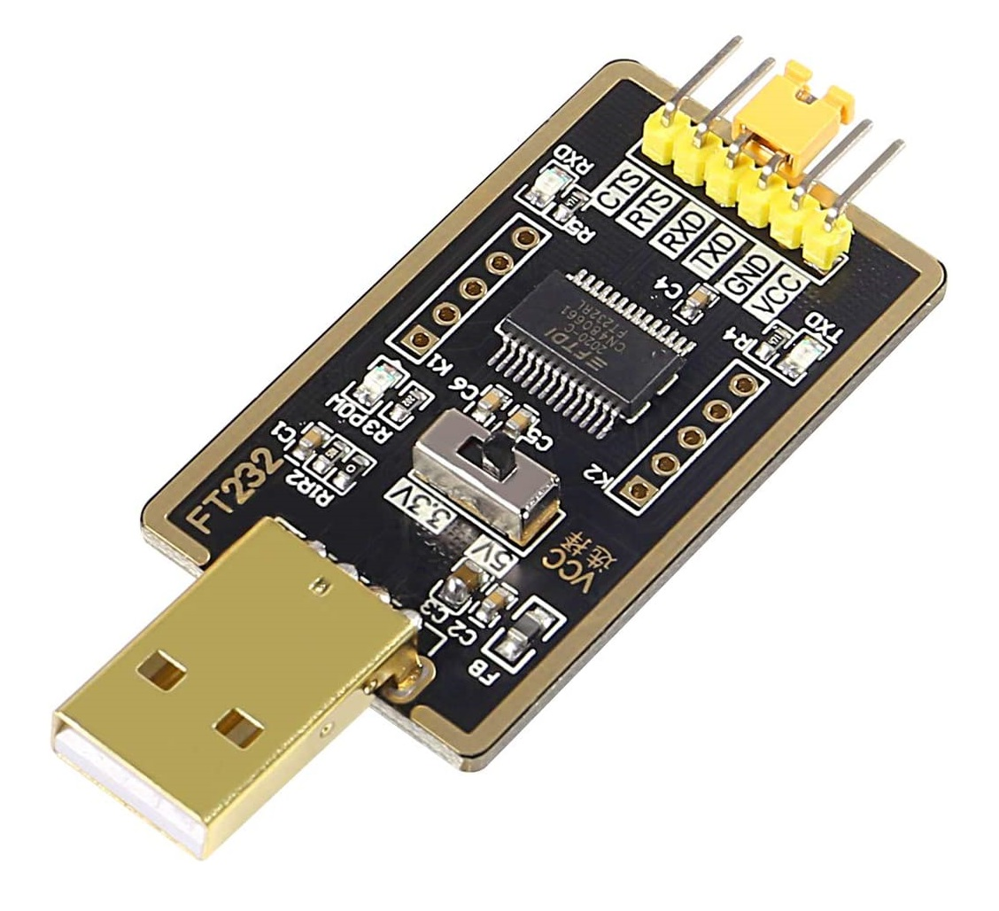
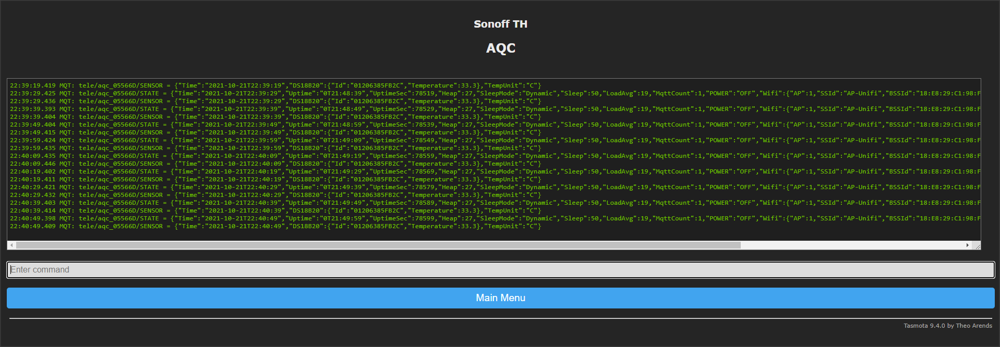

<h2>
AQC-Control
</h2>
<h3>
Tasmota automation to control a underfloor heating system.
</h3>
 
- Frist step do a hardware hack get dry contact relay on sonoff th16 .


#
- Second step flashing Sonoff TH16 with Tasmota.
- 1- Go to https://tasmota.github.io/docs/devices/Sonoff-TH/ and read.
- 2- Get a FTDI Module and make wire connections like this
-  
- 3.3v <-------> 3.3v
- GND <--------> GND
- TX <---------> RX
- RX <---------> TX
 
- 3- Go to https://github.com/tasmota/tasmotizer and download Tasmotizer run it and he will get the firmware for you. Happy hack .

- In case you have doubts don't forget make a Googling, this is a very documented subject on the internet and that's why I won't go into detail.
After Tasmota is connected to your wifi and configured as "Sonoff TH" let's move on to the next step.

#
- Third step go to the tasmota console and create the following RULES.


```diff
- ATENTION: the text (aqc_05566D) must be changed in all rules according to your "topic".
- Check tasmota console to see your topic name.
```
- Rule 1 create a thermo switch automation with a 24°C setpoint, this serves to keep the temperature inside water tank from falling below 24°C.

```
Rule1 ON DS18B20#Temperature<24 DO Power1 0 ENDON ON DS18B20#Temperature>24.5 DO Power1 1 ENDON
```
- Save Rule1 
```
Rule1 5
```
- Rule 2 turn on/off thermo switch automation and send the feedback through mqtt.
- Actions:
- 1click on sonoff button = turn ON Rule1 automation and send state to mqtt
- 2click on sonoff button = turn OFF Rule1 automation and send state to mqtt
- Long Press on sonoff button = toggle Rule1 automation "on/off manually on sonoff th16 button".
```
Rule2 ON Button1#State=2 DO BACKLOG Rule1 1; Publish stat/aqc_05566D/RULE1 ON ENDON ON Button1#State=11 DO BACKLOG Rule1 0; Power1 0; Publish stat/aqc_05566D/RULE1 OFF ENDON ON Button1#State=3 DO BACKLOG Rule1 0; Power1 toggle ENDON
```
- Save Rule2
```
Rule2 1
```
- Rule 3 mqtt feedback for HA & NodeRED Integration
```
Rule3 ON EVENT#aqcON DO BACKLOG Rule1 1; Publish stat/aqc_05566D/RULE1 ON ENDON ON EVENT#aqcOFF DO BACKLOG Rule1 0; Power1 0; Publish stat/aqc_05566D/RULE1 OFF ENDON
```
- Save Rule3
```
Rule3 1
```
#

# Ok now it's time to do the integration in Home Assistant go to configuration.yaml

```diff
- ATENTION: the text (aqc_05566D) must be changed in all rules according to your "topic".
- Check tasmota console to check your topic name.
```
```
switch:
  - platform: mqtt
    #unique_id: aqc_control_switch
    name: "AQC Control Switch"
    state_topic: "stat/aqc_05566D/RULE1"
    command_topic: "cmnd/aqc_05566D/EVENT"
    availability_topic: "tele/aqc_05566D/LWT"
    payload_available: "Online"
    payload_not_available: "Offline"
    payload_on: "aqcON"
    payload_off: "aqcOFF"
    state_on: "ON"
    state_off: "OFF"
    optimistic: false
    qos: 0
    retain: true
```
# My diagram

