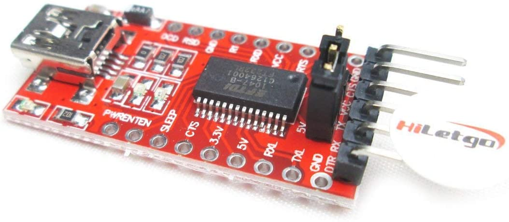

IOTizar-AQC

This automation on top of Tasmota is to control a underfloor heating system with Home Assistant.
#
- Frist step we have to do a hardware hack on sonoff th16 to get dry contact.

#
- Second step will be flashing Tasmota on Sonoff TH16.
- 1 Goto https://tasmota.github.io/docs/devices/Sonoff-TH/
- 2 Get a FTDI Module
- 
- 3 Goto https://github.com/tasmota/tasmotizer and download Tasmotizer.
- 
